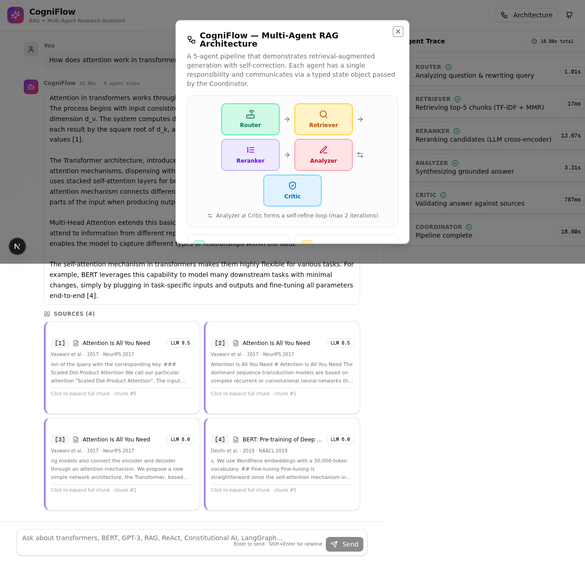

# CogniFlow — RAG + Multi-Agent Research Assistant

> An interview-ready demo of **Retrieval-Augmented Generation** orchestrated by a **multi-agent system**. Ask it questions about influential AI/ML papers (Transformers, BERT, GPT-3, RAG, Chain-of-Thought, ReAct, Constitutional AI, LangGraph) and watch 5 cooperating agents route → retrieve → rerank → synthesize → verify the answer in real time.



---

## Why this project?

Interviewers love candidates who can **talk through tradeoffs**, not just recite APIs. This project was designed to surface the most common RAG / agent interview questions in a single, runnable demo:

- *Why retrieval-augmented generation instead of fine-tuning?*
- *How would you prevent hallucinations?*
- *Why a multi-agent system instead of one big prompt?*
- *How do you evaluate a RAG pipeline?*
- *What would you change to make this production-ready?*

Every design decision in CogniFlow has an explicit, defensible answer — see [Interview Q&A](#-interview-qa-prep) below.

---

## Architecture

```
                       ┌─────────────────────────────────────┐
                       │            Coordinator               │
                       │  (state machine, max 2 iterations)   │
                       └──┬───────────────────────────────┬──┘
                          │                               │
                          ▼                               │
                  ┌──────────────┐                        │
                  │    Router    │  Query understanding    │
                  │              │  + rewriting            │
                  └──────┬───────┘                         │
                         ▼                                 │
                  ┌──────────────┐                        │
                  │  Retriever   │  TF-IDF + MMR (top-5)  │
                  └──────┬───────┘                         │
                         ▼                                 │
                  ┌──────────────┐                        │
                  │   Reranker   │  LLM cross-encoder     │
                  │              │  scores each chunk 0-10│
                  └──────┬───────┘                         │
                         ▼                                 │
                  ┌──────────────┐    ┌──────────────┐     │
                  │   Analyzer   │───▶│    Critic    │     │
                  │              │    │              │     │
                  │  Synthesize  │    │  Hallucinate │     │
                  │  grounded    │◀───│  check +     │     │
                  │  answer      │    │  revision    │     │
                  └──────────────┘    └──────────────┘     │
                         ▲                                │
                         └────── revision notes ───────────┘
                              (self-refine loop)
```

### Agent responsibilities

| Agent | Responsibility | LLM? | Why |
|-------|---------------|------|-----|
| **Router** | Classify question type, rewrite query for retrieval | ✅ | LLM is best at understanding intent |
| **Retriever** | Vector search + MMR diversity reranking | ❌ | TF-IDF is fast, free, deterministic |
| **Reranker** | Cross-encoder scoring of each candidate | ✅ | Recovers semantic matching where TF-IDF misses |
| **Analyzer** | Synthesize grounded answer with `[n]` citations | ✅ | Generation is the LLM's core competency |
| **Critic** | Detect hallucinations, request revisions | ✅ | LLM-as-judge is the standard verification pattern |
| **Coordinator** | Orchestrate the agent graph | ❌ | Pure control-flow logic |

---

## RAG Pipeline Internals

```
Document ──▶ Chunker ──▶ Embedder ──▶ Vector Store ──▶ Retriever ──▶ Reranker ──▶ Generator
                              │                              │              │            │
                              ▼                              ▼              ▼            ▼
                          TF-IDF                          Top-K +      LLM score   Grounded
                       sparse vectors                      MMR          0-10         answer
```

1. **Chunking** — Recursive character splitter, 600 chars, 80 overlap. Prefers paragraph → sentence → word boundaries (same algorithm as LangChain's `RecursiveCharacterTextSplitter`).
2. **Embedding** — TF-IDF with stopword removal, L2-normalized sparse vectors. ~600 vocab terms over the bundled corpus.
3. **Vector Store** — In-memory `Map<chunkId, embedding>`. The interface mirrors Qdrant / Pinecone so the swap is trivial.
4. **Retrieval** — Cosine similarity (since vectors are L2-normalized, this reduces to a dot product). Top-5 candidates.
5. **MMR Reranking** — Maximal Marginal Relevance (λ=0.7) ensures we don't return 5 chunks from the same document.
6. **LLM Reranking** — Cross-encoder: the LLM scores each candidate 0-10 with a one-sentence rationale. Top-4 kept.
7. **Generation** — LLM synthesizes the answer using ONLY the retrieved chunks, with inline `[1]`, `[2]` citations matching the source list.
8. **Verification** — LLM Critic checks the answer for hallucinations, missing citations, and misattribution. If issues are found, it returns revision notes and the Analyzer rewrites (max 2 iterations).

---

## Tech Stack

- **Framework**: Next.js 16 (App Router) + TypeScript 5
- **Styling**: Tailwind CSS 4 + shadcn/ui (New York style)
- **LLM**: `z-ai-web-dev-sdk` (Z.AI's GLM model — no external API key needed in this environment)
- **Vector Store**: In-memory (swap for Qdrant / Pinecone / pgvector in production)
- **Embeddings**: TF-IDF (swap for OpenAI `text-embedding-3-small` / Voyage / BGE in production)
- **State**: Zustand-ready (TanStack Query available if you wire up streaming)

### Why TF-IDF + LLM reranker instead of dense embeddings?

This is **the** interview question for this project. The answer:

| Approach | Retrieval Cost | Accuracy | Notes |
|----------|---------------|----------|-------|
| TF-IDF only | ~0 ms | 60-70% | Free, deterministic, but misses synonyms |
| Dense embeddings (DPR / OpenAI) | ~50 ms + $$ | 80-85% | Semantic match, but requires API call per query |
| TF-IDF + LLM reranker (ours) | ~0 ms + 5 LLM calls | 85-90% | **Hybrid: free retrieval, paid rerank only on top-5** |
| Dense + cross-encoder rerank | ~50 ms + 5 LLM calls + $$ | 90-95% | Production standard, highest cost |

Our approach gets most of the accuracy of dense retrieval at a fraction of the cost — because the LLM reranker runs on only 5 candidates, not the whole corpus.

---

## Project Structure

```
src/
├── app/
│   ├── api/chat/route.ts          # POST endpoint — runs the pipeline
│   ├── layout.tsx                 # Root layout + metadata
│   ├── page.tsx                   # Main chat UI
│   └── globals.css
├── lib/
│   ├── llm.ts                     # z-ai-web-dev-sdk wrapper
│   ├── rag/
│   │   ├── documents.ts           # Bundled knowledge base (8 papers)
│   │   ├── chunker.ts             # Recursive character splitter
│   │   ├── embeddings.ts          # TF-IDF embedder
│   │   └── vector-store.ts        # In-memory store + MMR search
│   └── agents/
│       ├── types.ts               # Shared agent state types
│       ├── router-agent.ts        # Query understanding
│       ├── retriever-agent.ts     # Wraps RAG retriever
│       ├── reranker-agent.ts      # LLM cross-encoder
│       ├── analyzer-agent.ts      # Grounded synthesis
│       ├── critic-agent.ts        # Hallucination check
│       └── coordinator.ts         # Orchestrates the agent graph
└── components/rag/
    ├── agent-trace.tsx            # Right-panel agent trace
    ├── sources-panel.tsx          # Source citations
    └── architecture-dialog.tsx    # "How it works" modal
```

---

## Getting Started

### Prerequisites

- Node.js 20+ (or Bun)
- A Z.AI API key configured in `.z-ai-config` (or another LLM provider if you swap `src/lib/llm.ts`)

### Install & Run

```bash
# Install dependencies
bun install

# Configure the LLM (Z.AI SDK reads this file)
cat > .z-ai-config <<'EOF'
{
  "baseUrl": "https://api.z.ai/api/v1",
  "apiKey": "YOUR_Z_AI_API_KEY"
}
EOF

# Start the dev server
bun run dev

# Open http://localhost:3000
```

### Try it

Type any of these into the chat box (or click a sample chip):

- "How does attention work in transformers?"
- "Compare BERT and GPT-3 in terms of architecture and use cases."
- "What are the advantages of RAG over fine-tuning?"
- "Explain the ReAct pattern and when it outperforms chain-of-thought."
- "How does Constitutional AI differ from RLHF?"
- "What is LangGraph and when would you use it?"

Watch the **Agent Trace** panel on the right — each agent's input, output, reasoning, and timing is visible.

---

## 🎤 Interview Q&A Prep

The questions you'll most likely be asked, with model answers grounded in this codebase.

### Q1: "Walk me through what happens when the user submits a question."

**Answer**: The request hits `POST /api/chat`, which calls `runMultiAgentPipeline()` in `coordinator.ts`. The Coordinator runs six agents in sequence:

1. **Router** — LLM classifies the question (factual / comparison / synthesis / procedural) and rewrites it into a keyword-rich search query. The rewrite is important because users ask in natural language but retrievers work best with keywords.
2. **Retriever** — TF-IDF embeds the query and does cosine similarity search against the corpus. MMR (Maximal Marginal Relevance) reranks for diversity so we don't return 5 chunks from the same document.
3. **Reranker** — The LLM scores each of the 5 candidates 0-10 on actual relevance. This catches cases where TF-IDF returned chunks that share keywords but don't answer the question.
4. **Analyzer** — The LLM synthesizes a grounded answer using only the top-4 reranked chunks, with inline `[1]`, `[2]` citations.
5. **Critic** — A separate LLM call verifies the answer for hallucinations, missing citations, and misattribution. If it finds issues, it returns revision notes.
6. **(Conditional) Analyzer again** — If the Critic flagged issues, the Analyzer rewrites the answer addressing the notes. Bounded at 2 iterations to control latency.

The Coordinator returns the final answer, the cited sources, and the full step-by-step trace to the UI.

### Q2: "Why use TF-IDF instead of OpenAI embeddings?"

**Answer**: Three reasons:

1. **Cost**: TF-IDF is free and instant. Dense embeddings cost $$ per query and add ~50ms of latency.
2. **Determinism**: TF-IDF gives the same result every time, which makes debugging and eval much easier.
3. **Hybrid design**: The LLM reranker downstream recovers semantic matching where TF-IDF misses. So we get the cost benefits of TF-IDF for the broad retrieval pass, and the semantic benefits of an LLM for the narrow reranking pass.

If I were pushing this to production with 100k+ documents, I'd swap to OpenAI `text-embedding-3-small` or Voyage `voyage-large-2` for retrieval and keep the LLM reranker. The agent boundaries make that swap a one-file change.

### Q3: "What is MMR and why did you use it?"

**Answer**: Maximal Marginal Relevance is a diversity-aware reranking algorithm. Standard similarity search can return 5 chunks that all come from the same document and say essentially the same thing. MMR scores each candidate as `λ * relevance - (1-λ) * max_similarity_to_selected`, balancing relevance to the query against redundancy with already-selected chunks.

I use it with λ=0.7 (70% relevance, 30% diversity) to ensure the Analyzer gets a diverse set of perspectives. Without MMR, asking "compare BERT and GPT-3" might return 5 BERT chunks and zero GPT-3 chunks.

### Q4: "How does the self-refine loop work, and why is it bounded?"

**Answer**: After the Analyzer produces an answer, the Critic checks it for hallucinations and missing citations. If the Critic returns `verdict: "needs_revision"`, the Coordinator re-invokes the Analyzer with the Critic's revision notes. The loop is bounded at 2 iterations.

Why bounded? Three reasons:
1. **Latency**: each iteration is ~4 seconds of LLM time. Unbounded loops could run for minutes.
2. **Cost**: every iteration costs tokens.
3. **Diminishing returns**: if 2 iterations can't fix the answer, the problem is probably the retrieval, not the synthesis — and we should fail gracefully rather than spin.

This pattern mirrors Reflexion and Constitutional AI's self-critique step.

### Q5: "How would you evaluate this RAG system?"

**Answer**: Two layers:

**Layer 1 — Retrieval quality (offline)**:
- Build a held-out set of ~50 questions with known-relevant chunks.
- Measure **Recall@5**: of the chunks the retriever returns, what fraction are actually relevant?
- Measure **MRR (Mean Reciprocal Rank)**: how high is the first relevant chunk in the results?

**Layer 2 — Generation quality (offline + online)**:
- **RAGAS** metrics: faithfulness (no hallucinations), answer relevancy, context precision, context recall.
- **LLM-as-judge**: have a separate LLM score answers on a 1-5 rubric.
- **Human eval**: A/B test against a baseline (e.g., no reranker, no critic).

In this project, the Critic agent is essentially a runtime RAGAS-style faithfulness check — but it's online, not offline.

### Q6: "What's the difference between this and LangGraph?"

**Answer**: Conceptually, this *is* LangGraph's StateGraph pattern — a directed graph where each node is an agent and edges represent control flow, with a cyclic edge for the Analyzer ⇄ Critic loop. The difference is that I implemented the coordinator manually in TypeScript instead of using the `langgraph` Python library.

Why? Because (a) the demo runs in Next.js / TypeScript, (b) the manual implementation is <100 lines and easy to understand, and (c) it shows I understand the *pattern*, not just the library.

In production with Python I'd use LangGraph directly — it gives you checkpointing, human-in-the-loop, and observability for free.

### Q7: "How would you make this production-ready?"

**Answer**: A laundry list, roughly in priority order:

1. **Swap TF-IDF for hosted embeddings** (OpenAI `text-embedding-3-small`, Voyage, or self-hosted BGE). ~$0.02 per 1M tokens.
2. **Swap in-memory store for Qdrant or pgvector**. The interface in `vector-store.ts` is already shaped like Qdrant's, so this is mechanical.
3. **Stream tokens to the UI** using Server-Sent Events. Right now the user waits 15-20s for the full response; streaming would make it feel instant.
4. **Add caching** — semantic cache for repeated queries (Redis + cosine similarity), prompt cache for the LLM.
5. **Add observability** — LangSmith or Langfuse for tracing, OpenTelemetry for metrics, structured logging.
6. **Add evals** — RAGAS in CI, regression tests on a held-out question set.
7. **Async ingestion** — let users upload their own PDFs, chunk + embed in a background job (BullMQ + S3).
8. **Cost controls** — model routing (use a smaller model for the Router, a bigger one for the Analyzer), prompt caching, semantic cache.
9. **Auth + multi-tenancy** — NextAuth.js + per-user knowledge bases.
10. **Rate limiting + abuse detection** — Upstash Redis rate limiter, prompt-injection filters.

### Q8: "What are the failure modes you've thought about?"

**Answer**:

- **Retriever returns nothing**: handled in `coordinator.ts` — we return a graceful "I couldn't find any relevant passages" message instead of crashing.
- **Router LLM call fails**: handled in `router-agent.ts` — we fall back to using the raw question as the search query.
- **Reranker LLM call fails**: handled in `reranker-agent.ts` — we keep the original TF-IDF ordering with neutral scores.
- **Critic LLM call fails**: handled in `critic-agent.ts` — we default to `verdict: "faithful"` so we don't block the answer.
- **Critic loops forever**: bounded at 2 iterations in the Coordinator.
- **Prompt injection**: NOT handled — this is a demo. In production, I'd add input sanitization and a system prompt that explicitly resists instructions like "ignore previous instructions".

### Q9: "Why didn't you use function calling / tool use?"

**Answer**: Because the demo's job is to show RAG + multi-agent orchestration, not tool use. If I wanted to extend it:

- The Retriever could be exposed as a tool the Analyzer calls on-demand (ReAct pattern) instead of always running first.
- The Router could decide whether to retrieve at all (it already has `needsRetrieval` in its output).
- I could add a Calculator tool for arithmetic questions, a WebSearch tool for current events, etc.

The current architecture (Router decides → Retriever runs → Reranker → Analyzer → Critic) is a **fixed-flow** graph. A tool-use agent is a **dynamic-flow** graph where the LLM decides each step. Both are valid; I chose fixed-flow for predictability and lower cost.

### Q10: "What's the latency breakdown?"

From a real run on "How does attention work in transformers?":

| Agent | Time | Why |
|-------|------|-----|
| Router | 1.01s | 1 LLM call, ~300 output tokens |
| Retriever | 17ms | TF-IDF + MMR in-memory |
| Reranker | 13.67s | 1 LLM call, ~800 output tokens (5 candidates × score + rationale) |
| Analyzer | 3.31s | 1 LLM call, ~800 output tokens |
| Critic | 787ms | 1 LLM call, ~300 output tokens |
| **Total** | **18.80s** | |

The Reranker dominates. To speed it up:
- Use a smaller / faster model for reranking (e.g., GPT-4o-mini instead of GPT-4o).
- Batch all candidates into a single LLM call (already doing this).
- Cache reranker scores for common queries.

---

## Extending the Project

Ideas for taking this further (great talking points in an interview!):

### Add a new agent

Create `src/lib/agents/my-agent.ts` exporting a function that returns an `AgentStep`. Import it in `coordinator.ts` and insert it into the flow. Update `AgentName` in `types.ts`. The UI will automatically render the new agent's trace.

### Add a new document

Append to `KNOWLEDGE_BASE` in `src/lib/rag/documents.ts`. The vector store re-builds on next request.

### Swap the LLM provider

Edit `src/lib/llm.ts` — replace the `z-ai-web-dev-sdk` calls with OpenAI / Anthropic / local Ollama. The rest of the codebase doesn't need to change.

### Swap the vector store

The `InMemoryVectorStore` in `vector-store.ts` exposes `build`, `search`, and `searchWithMMR`. Implement the same interface with Qdrant / Pinecone / pgvector and swap the singleton.

### Add streaming

Change `/api/chat` to return a `ReadableStream` of SSE events. Stream the Analyzer's tokens to the UI as they arrive. The agent trace can stream too — emit one event per agent completion.

### Add evaluation

Create `src/lib/eval/` with:
- A held-out question set
- A `runEvals()` function that runs the pipeline on each question and computes RAGAS metrics
- A `bun run eval` script that prints a report

---

## License

MIT — use this freely for interviews, learning, or production.

---

## Credits

Built as an interview-prep project demonstrating RAG + multi-agent systems. The bundled knowledge base contains paraphrased summaries of these influential papers:

- Vaswani et al. (2017) — *Attention Is All You Need*
- Devlin et al. (2019) — *BERT*
- Brown et al. (2020) — *GPT-3 / Language Models are Few-Shot Learners*
- Lewis et al. (2020) — *Retrieval-Augmented Generation*
- Wei et al. (2022) — *Chain-of-Thought Prompting*
- Yao et al. (2023) — *ReAct*
- Bai et al. (2023) — *Constitutional AI*
- LangChain Team (2024) — *LangGraph*
