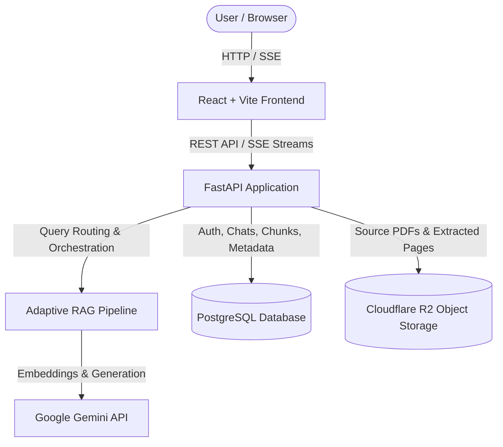

# CogniFlow — Adaptive Hybrid Text RAG

CogniFlow is a full-stack text-based Retrieval-Augmented Generation (RAG) application. It couples a React (Vite) interface with a Python FastAPI backend to provide grounded query answering over uploaded documents.

The system uses adaptive query routing, hybrid lexical and semantic retrieval, deterministic citation and provenance tracking, concept-coverage answerability verification, and streaming response generation. Persistent application state is managed in PostgreSQL, and source documents are stored in Cloudflare R2.

---

## Architecture


```mermaid
flowchart TD
    User([User / Browser])
    Frontend[React + Vite Frontend]
    Backend[FastAPI Application]
    Pipeline[Adaptive RAG Pipeline]
    DB[(PostgreSQL Database)]
    R2[(Cloudflare R2 Object Storage)]
    LLM[Google Gemini API]

    User -->|HTTP / SSE| Frontend
    Frontend -->|REST API / SSE Streams| Backend
    Backend -->|Query Routing & Orchestration| Pipeline
    Backend -->|Auth, Chats, Chunks, Metadata| DB
    Backend -->|Source PDFs & Extracted Pages| R2
    Pipeline -->|Embeddings & Generation| LLM
```

---

## Core Features

- **Pipeline Modes**:
  - `fast`: Low-latency retrieval optimized for simple, factual lookups.
  - `adaptive_rag`: Dynamic retrieval depth and strategy selection based on query classification.
  - `deep_research`: Multi-step query decomposition, iterative evidence retrieval, and structured synthesis.
  - `general_chat`: Conversational responses bypassing document retrieval when queries do not require external evidence.
- **Hybrid Retrieval**: Combines sparse lexical retrieval (TF-IDF keyword matching) with dense retrieval via Latent Semantic Analysis (LSA TruncatedSVD).
- **Rank Fusion**: Merges lexical and dense candidate rankings using Reciprocal Rank Fusion (RRF).
- **Diversity & Reranking**: Applies Maximal Marginal Relevance (MMR) to reduce candidate redundancy before final scoring.
- **Answerability Gating**: Evaluates retrieved concept coverage against query entities. The system refrains from answering when source evidence is insufficient.
- **Deterministic Citations**: Inserts stable bracketed evidence identifiers (such as `[E1]`, `[E2]`) tied to specific source files, section headings, and page ranges.
- **Interactive Provenance**: Displays citation evidence popovers and loads original source PDFs aligned to cited pages.
- **Streaming Delivery**: Streams generated responses and pipeline lifecycle events over Server-Sent Events (SSE).
- **Access Control & Multi-Tenancy**: Implements JWT-based user authentication, bcrypt password hashing, and owner-level document and chat isolation.
- **Document Management**: Handles multi-page PDF ingestion, text extraction, deterministic chunking, and compensating rollbacks on storage failure.
- **Document Summaries**: Supports hierarchical Map-Reduce summarization with cache persistence for repeated requests.
- **Telemetry & Diagnostics**: Emits stage-by-stage timing metrics, strategy selections, and token counts.

---

## Technology Stack

| Layer | Technologies |
| :--- | :--- |
| **Frontend** | React 19, Vite, Tailwind CSS, Radix UI primitives, PDF.js (`pdfjs-dist`) |
| **Backend** | Python 3.12, FastAPI, Uvicorn, Pydantic v2 |
| **RAG & Information Retrieval** | scikit-learn (TF-IDF, TruncatedSVD), NumPy, PyMuPDF (fitz) |
| **Language Model & Embeddings** | Google Gemini API (`google-genai`), optional OpenRouter fallback |
| **Database** | PostgreSQL (psycopg2-binary, connection pooling via Supabase pooler) |
| **Object Storage** | Cloudflare R2 (S3-compatible via `boto3`), local filesystem fallback for development |
| **Deployment** | Render (Backend web service), Vercel (Frontend SPA) |

---

## Project Structure

```
.
├── backend/
│   ├── api/             # FastAPI routers (auth, chat, chats, documents, evaluation, health)
│   ├── config.py        # Centralized environment configuration and validation
│   ├── db/
│   │   └── schema.sql   # Complete PostgreSQL relational schema definitions
│   ├── main.py          # FastAPI application entry point and middleware configuration
│   ├── models.py        # Pydantic request, response, and domain models
│   ├── rag/             # Retrieval, chunking, LSA, citations, MMR, and pipeline logic
│   ├── services/        # Database, storage, auth, telemetry, and LLM provider implementations
│   ├── tests/           # Automated pytest test suites and benchmark scripts
│   └── requirements.txt # Python dependency specifications
├── client/
│   ├── public/          # Static assets, including the PDF.js web worker
│   ├── src/
│   │   ├── api/         # Frontend API clients and SSE stream consumers
│   │   ├── components/  # Layout, RAG panels, PDF viewer, and UI components
│   │   ├── pages/       # Route views (Chat, Documents, Evaluation, Architecture, Auth)
│   │   ├── store/       # Client-side state stores (Zustand)
│   │   ├── App.jsx      # Root component
│   │   └── main.jsx     # Frontend entry point
│   ├── package.json     # Node.js dependencies and build scripts
│   └── vite.config.js   # Vite configuration with local API proxying
├── test-data/           # Evaluation documents and test fixtures
├── .env.example         # Template for environment variables
├── render.yaml          # Render deployment manifest
└── vercel.json          # Vercel SPA routing and header configuration
```

---

## Local Development

### Prerequisites

- Python 3.12 or later
- Node.js 20 or later and npm
- A PostgreSQL instance (local or hosted like Supabase)
- An active Google Gemini API key

### 1. Backend Setup

From the repository root, create and activate a virtual environment:

```bash
# Windows (PowerShell)
python -m venv .venv
.\.venv\Scripts\Activate.ps1

# Linux / macOS
python3 -m venv .venv
source .venv/bin/activate
```

Install the backend dependencies:

```bash
pip install -r backend/requirements.txt
```

Configure your local environment variables by copying the template:

```bash
cp .env.example .env
```

Edit `.env` with your actual service credentials. Sensitive configuration must remain in `.env` and should never be committed to source control.

Start the FastAPI development server:

```bash
python -m uvicorn backend.main:app --host 127.0.0.1 --port 3001 --reload
```

The backend API will be available at `http://127.0.0.1:3001`. Interactive API documentation is accessible at `http://127.0.0.1:3001/docs`.

### 2. Frontend Setup

In a separate terminal, navigate to the `client` directory:

```bash
cd client
npm install
npm run dev
```

The Vite development server will launch at `http://localhost:5173`. Requests to `/api` are automatically proxied to `http://127.0.0.1:3001`.

---

## Environment Variables

All variables are defined in `.env.example`. Secrets must be configured on the host or in local `.env` files.

### Backend Variables (Server-Only, Never Exposed to Frontend)

- `DATABASE_URL`: PostgreSQL connection string (supports SSL and transaction poolers).
- `STORAGE_BACKEND`: Storage driver to use (`r2` for Cloudflare R2, `local` for local disk).
- `R2_ACCOUNT_ID`: Cloudflare account identifier.
- `R2_ACCESS_KEY_ID`: Cloudflare R2 API token access key.
- `R2_SECRET_ACCESS_KEY`: Cloudflare R2 API token secret access key.
- `R2_BUCKET_NAME`: Target R2 bucket name.
- `R2_ENDPOINT`: S3 endpoint URL for Cloudflare R2.
- `GEMINI_API_KEY`: API key for Google Gemini LLM and embedding calls.
- `OPENROUTER_API_KEY`: Optional fallback API key for OpenRouter models.
- `JWT_SECRET`: Cryptographic secret key used to sign and verify session JWTs.
- `CORS_ORIGINS`: Comma-separated list of allowed frontend origin URLs.
- `PORT`: Port on which the backend server listens (default: `3001`).
- `HOST`: Host address for the backend server (default: `0.0.0.0`).

### Frontend Variables (Publicly Accessible)

- `VITE_API_BASE_URL`: Base URL for backend API requests (e.g., `http://localhost:3001` in local development or the Render URL in production).

---

## Database

CogniFlow uses PostgreSQL for relational data storage:

- The database schema is located at [`backend/db/schema.sql`](backend/db/schema.sql).
- The schema defines tables and indexes for:
  - `users`: User identity records and password hashes.
  - `conversations`: Chat sessions scoped by owner.
  - `messages`: Individual chat interactions and associated metadata JSON.
  - `documents`: Document catalog, ownership, storage keys, and processing status.
  - `document_chunks`: Structured text chunks with page numbers and offsets.
  - `document_embeddings`: Precomputed dense vectors.
  - `document_summaries`: Cached Map-Reduce hierarchical summaries.
- The schema can be executed directly against any PostgreSQL instance or through the SQL editor of hosted providers such as Supabase.

---

## Object Storage

Uploaded files and extracted artifacts are stored using Cloudflare R2 in production:

- **Original Documents**: Uploaded PDFs are stored in private R2 paths (`uploads/{doc_id}/original`).
- **Extracted Text**: Page-by-page extracted JSON structures are stored in `extracted/{doc_id}/pages.json`.
- **Security Boundary**: The R2 bucket remains strictly private. Document viewing and streaming are routed through authorized backend endpoints (`/api/documents/{id}/pdf`). The frontend never receives R2 access keys or credentials.
- **Local Fallback**: Setting `STORAGE_BACKEND=local` writes files to the local `data/` directory for offline testing.

---

## RAG Pipeline Flow

When a user submits a query, the backend processes it through a sequential pipeline:

1. **Query Classification**: Identifies query intent (factual lookup, thematic analysis, summarization, or conversational query) and assigns an execution mode.
2. **Adaptive Retrieval**: Determines document filtering rules and retrieval depth based on intent.
3. **Lexical Retrieval**: Calculates term frequency and inverse document frequency (TF-IDF) scores across indexed chunks.
4. **LSA Dense Retrieval**: Projects chunk texts and query terms into latent semantic space using TruncatedSVD to capture conceptual similarities.
5. **Reciprocal Rank Fusion (RRF)**: Merges lexical and semantic candidate lists into a single ranked ordering.
6. **MMR Diversification & Reranking**: Applies Maximal Marginal Relevance to select informative chunks while penalizing redundancy, followed by score normalization.
7. **Answerability Gating**: Computes concept coverage across top-ranked chunks. If key query concepts are unsupported by the corpus, the pipeline short-circuits to avoid unsupported claims.
8. **Generation**: Sends system instructions, user query, and grounded context passages to Gemini for completion.
9. **Citation Verification**: Parses generated citations, checks each evidence tag against retrieved candidate chunk IDs, and verifies page provenance before streaming to the client.

---

## Testing

The project includes an automated backend test suite using `pytest`.

Run the full test suite from the repository root:

```bash
python -m pytest backend/tests/ -v
```

The test suite covers:

- **Authentication & User Sessions**: Registration, credential verification, JWT generation, and token expiration.
- **Authorization & Multi-Tenant Isolation**: Row-level document isolation, cross-user delete prevention, and admin permissions.
- **Citations & Provenance**: Evidence extraction from streamed tokens, untruncated source excerpts, and page-level grounding.
- **RAG Behavior & Correctness**: Concept coverage gating, out-of-domain query abstention, and SSE event streaming.
- **Deletion Consistency & Rollbacks**: Multi-system rollback behavior across database, vector store, and physical storage.
- **Summarization**: Map-Reduce page partitioning, summary cache invalidation, and progress reporting.
- **Storage Lifecycle**: Supabase PostgreSQL entity CRUD, Cloudflare R2 upload and download routines, and ephemeral disk recovery.
- **Retrieval Modes**: Strategy comparison, MMR diversity calculation, and evaluator calibration.

---

## Benchmarking

A standalone benchmark script is provided to measure local resource utilization and startup performance:

```bash
python backend/tests/benchmark_free_tier.py
```

The script measures:
- Database initialization and pool connection latency.
- Storage service initialization time.
- In-memory vector index rebuild duration from stored database chunks.
- Peak resident set size (RSS) memory consumption.

*Note: All benchmark output values reflect local execution hardware and development network conditions. They are diagnostic measurements rather than production SLA guarantees.*

---

## Deployment

The application is structured for deployment across low-cost or free cloud tiers:

- **Frontend (Vercel)**: Hosted as a static single-page application using the configuration in [`vercel.json`](vercel.json). Routing rules forward all non-asset requests to `index.html`.
- **Backend (Render)**: Deployed as a web service using [`render.yaml`](render.yaml). Builds from `backend/requirements.txt` and executes via Uvicorn.
- **Database (Supabase)**: Provides managed PostgreSQL with connection pooling on port 6543.
- **Object Storage (Cloudflare R2)**: Provides S3-compatible, egress-free object storage.
- **AI Providers (Google Gemini)**: Serves generation and embedding calls over HTTPS.

---

## Security

CogniFlow implements several security controls:

- **Session Security**: Stateless JSON Web Tokens signed with HMAC-SHA256. Passwords hashed using `bcrypt` with unique salts.
- **Multi-Tenant Ownership**: Documents and chat sessions are bound to specific `owner_id` fields. Non-admin users cannot access, modify, or delete resources owned by other users.
- **Secret Separation**: Third-party API keys (Gemini, Supabase, Cloudflare R2) and cryptographic secrets reside strictly in backend environment variables.
- **Storage Authorization**: Object storage buckets do not allow public reads. Authorized document downloads require valid user session headers and pass through backend streaming proxies.
- **Input Validation**: Request bodies and parameters are strictly validated using Pydantic schemas.

---

## Current Limitations

- **In-Memory Retrieval Index**: TF-IDF matrices and LSA vectors are constructed in memory at backend startup from stored chunks. While this removes external vector database requirements, restart times scale with corpus size.
- **Single-Instance Background Tasks**: In-process background summarization tasks execute inside the FastAPI event loop and are not distributed across multiple worker processes.
- **Ephemeral Container Storage**: On container platforms with ephemeral disks (such as Render free tiers), local files outside R2 and PostgreSQL do not survive container restarts.
- **Free-Tier Cold Starts**: Free-tier hosting providers may put backend containers to sleep after periods of inactivity, resulting in initial request latency upon wake-up.

---

## Contributing

1. Fork the repository and create a feature branch.
2. Ensure existing code conventions and formatting are preserved.
3. Run the complete backend test suite (`python -m pytest backend/tests/ -v`) to confirm that all tests pass.
4. Submit a pull request with a concise technical description of the proposed changes.

---

## License

No license is currently specified for this repository. All rights are reserved by the repository owner until a formal license is added.
