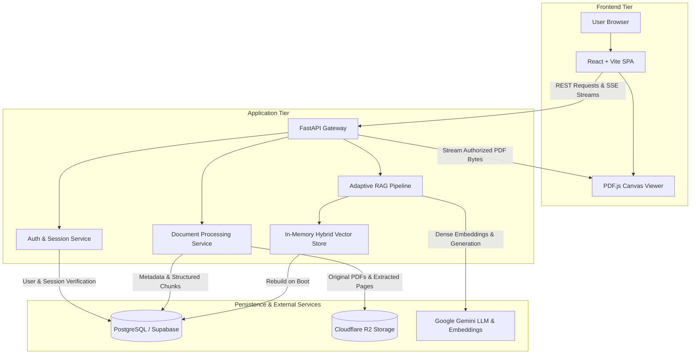
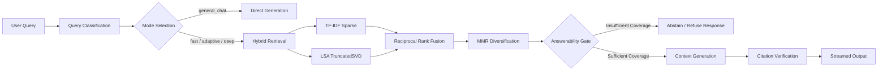

# CogniFlow System Architecture

This document describes the architectural design, component interactions, data flows, and security model of the CogniFlow application.

---

## 1. Overview

CogniFlow is a text-based Retrieval-Augmented Generation (RAG) system engineered to answer user queries grounded in uploaded reference documents. The architecture separates concerns across three primary tiers:

- **Client Tier (Frontend)**: A React 19 single-page application built with Vite and Tailwind CSS. It manages user interaction, document upload, Server-Sent Events (SSE) stream consumption, and page-accurate PDF rendering with highlighted citations.
- **Application Tier (Backend)**: A Python 3.12 FastAPI service that provides RESTful endpoints, streaming pipelines, query classification, hybrid retrieval, answerability verification, and multi-tenant authorization.
- **Data Tier (Persistence & Storage)**: A dual-storage architecture utilizing PostgreSQL for relational data and catalog metadata, and Cloudflare R2 for S3-compatible object storage.

---

## 2. System Architecture



---

## 3. Frontend Architecture

The client application is located in `client/` and is structured as a component-driven Single Page Application (SPA).

- **Framework & Bundler**: React 19 with Vite 6. Routing is managed via `react-router-dom` in `client/src/routes/router.jsx`.
- **Primary Pages**:
  - `ChatPage`: Main conversation workspace, query input, streaming response view, and citation source panel.
  - `DocumentsPage`: Document catalog, multi-file upload zone, status tracking, and deletion controls.
  - `EvaluationPage`: Diagnostic view showing latency percentiles, strategy comparisons, and evaluation runs.
  - `ArchitecturePage`: Interactive system diagram and architecture reference.
  - `AuthPage`: User registration and authentication interface.
- **State Management**: Zustand stores manage decoupled application state:
  - `use-auth-store.js`: Manages user profile, JWT tokens, session lifecycle, and authentication headers.
  - `use-chat-store.js`: Manages active conversations, messages, SSE token buffering, and citation lists.
  - `use-ui-store.js`: Controls sidebar states, dialog visibility, and modal navigation.
- **API & Streaming Client**: `client/src/api/client.js` wraps `fetch` to automatically append JWT bearer tokens. Streaming queries in `client/src/api/chat.js` consume HTTP chunks via `ReadableStream` to process JSON-encoded SSE events.
- **PDF Viewing**: Built on `pdfjs-dist` with a dedicated web worker (`client/public/pdf.worker.min.mjs`). The viewer supports dynamic page jumps triggered by citation click events.

---

## 4. Backend Architecture

The backend application is located in `backend/` and follows a modular layered architecture.

- **FastAPI Application (`backend/main.py`)**: Configures CORS middleware, registers routers, and coordinates startup lifecycle events (such as database initialization and vector store pre-warming).
- **API Routing Layer (`backend/api/`)**:
  - `auth.py`: User registration, login, profile queries, and logout.
  - `chats.py`: Conversation CRUD operations and message persistence.
  - `chat.py`: Primary query endpoint providing streaming SSE responses.
  - `documents.py`: Document upload, metadata retrieval, raw file streaming, and document deletion.
  - `evaluation.py`: Performance telemetry retrieval and evaluation trigger endpoints.
  - `health.py`: Liveness and readiness probes.
- **Service Layer (`backend/services/`)**:
  - `auth_service.py`: Password hashing with bcrypt, JWT token signing/verification, and identity extraction.
  - `db_service.py`: Relational database operations using connection-pooled PostgreSQL with fallback support.
  - `storage_service.py`: S3 API abstraction targeting Cloudflare R2 with local disk fallback.
  - `document_service.py`: File ingestion coordinator handling extraction, chunking, and storage synchronization.
  - `llm_service.py` & `llm_provider.py`: Unified interface to Google Gemini with optional OpenRouter fallback.
  - `summary_cache.py`: Dual-layer (memory and database) caching for hierarchical document summaries.
  - `telemetry_service.py`: Execution event collection, latency logging, and timing breakdowns.

---

## 5. RAG Pipeline

The RAG pipeline (`backend/rag/pipeline.py`) coordinates query execution through a sequential multi-stage flow:



1. **Query Classification**: `backend/rag/classifier.py` analyzes the prompt to identify intent (simple lookup, comparative analysis, summarization, or conversational general chat).
2. **Adaptive Retrieval**: `backend/rag/adaptive_controller.py` dynamically adjusts chunk retrieval limits ($k$) and filtering constraints based on query classification.
3. **Lexical Retrieval**: Computes sparse term-frequency inverse-document-frequency (TF-IDF) similarity scores across all indexed document chunks.
4. **LSA Semantic Retrieval**: Projects chunk and query vectors into a reduced semantic subspace using Latent Semantic Analysis (`scikit-learn` `TruncatedSVD`). LSA captures latent thematic similarity without requiring external neural embedding services.
5. **Hybrid Fusion (RRF)**: Merges the lexical and dense candidate rankings using Reciprocal Rank Fusion:
   $$RRF(d) = \sum_{m \in M} \frac{1}{60 + r_m(d)}$$
6. **MMR Diversification**: `backend/rag/mmr.py` calculates Maximal Marginal Relevance across candidates to eliminate semantic redundancy in the final context window.
7. **Answerability & Concept Coverage**: `backend/rag/concept_coverage.py` and `backend/rag/answerability.py` identify critical entities and key concepts in the query. If the top-ranked passages fail to reach the answerability coverage threshold, the pipeline refuses to answer to avoid unsupported claims.
8. **Generation**: Constructs a structured system prompt containing verified context passages, evidence tags, and strict formatting guidelines, which is submitted to Google Gemini.
9. **Citation Verification**: `backend/rag/citations.py` parses evidence tags from the generated text, cross-references them against retrieved chunk IDs, and verifies page provenance before emitting citations.

---

## 6. Execution Modes

CogniFlow provides four distinct execution modes:

- **`fast`**: Designed for high-speed, direct factual queries. Uses a restricted retrieval count ($k=3$), minimal reranking, and shorter generation token limits.
- **`adaptive_rag`**: The default operating mode. Dynamically tunes retrieval depth ($k=5\text{ to }12$), applies hybrid RRF and MMR diversification, and runs concept-coverage answerability validation.
- **`deep_research`**: Multi-stage research pipeline. Decomposes the query into sub-queries, executes iterative retrieval across multiple passes, synthesizes aggregated findings, and executes a secondary critic validation pass.
- **`general_chat`**: Bypasses document retrieval, vector search, and concept-coverage checks entirely. Routes conversational queries directly to the LLM.

---

## 7. Document Ingestion

Document ingestion coordinates processing from raw file upload to indexed chunks:

1. **Upload**: Client uploads a PDF through `POST /api/documents`.
2. **Storage**: The binary PDF is written to Cloudflare R2 at `uploads/{doc_id}/original`.
3. **Text Extraction**: PyMuPDF (`fitz`) parses the PDF page by page, producing structured text with page numbers, bounding metadata, and character counts. Extracted content is written to R2 at `extracted/{doc_id}/pages.json`.
4. **Semantic Chunking**: `backend/rag/chunker.py` segments document text into discrete chunks while preserving paragraph boundaries, section headings, and page ranges.
5. **Database Persistence**: Metadata records are written to PostgreSQL `documents` and individual chunk records are written to `document_chunks`.
6. **Vector Index Update**: The in-memory vector store recalculates vocabulary, IDF matrices, and LSA projection vectors to include the new chunks.
7. **Background Summarization**: An asynchronous task is dispatched to precompute the document's Map-Reduce summary in the background.

---

## 8. Retrieval Index

CogniFlow maintains an in-memory vector store (`backend/rag/vector_store.py`) to eliminate external vector database hosting dependencies:

- **Component Representation**:
  - Sparse index: TF-IDF vectorizer fitted on the corpus vocabulary.
  - Dense index: `TruncatedSVD` projection matrix fitted on the TF-IDF representation.
- **Startup Rebuild**: When the backend process starts, it queries the `document_chunks` table from PostgreSQL, loads all active chunk contents into memory, and fits the vector models.
- **Rationale**: For small- to medium-sized organizational document collections, in-memory matrix operations execute in sub-millisecond time and fit well within low-memory environments (such as Render's 512 MB free tier), removing the operational overhead of a standalone vector database.

---

## 9. Citations and Provenance

Grounded generation relies on strict deterministic evidence mapping:

- **Evidence Identifiers**: Context passages provided to the LLM are tagged with discrete evidence markers (`[E1]`, `[E2]`, etc.).
- **Deterministic Mapping**: Each evidence marker corresponds directly to a retrieved chunk with known `document_id`, `original_filename`, `page_number` (or `page_start`–`page_end`), and section heading.
- **Fail-Safe Stripping**: `backend/rag/citations.py` scans the model output for citation tokens. Any citation referencing an evidence tag not provided in the input context is stripped from the response text.
- **PDF Navigation**: The frontend citation card displays exact page numbers. Clicking a citation opens the PDF viewer and jumps directly to the cited page.

---

## 10. Persistence Architecture

Persistent application state is segregated across PostgreSQL and Cloudflare R2:

### PostgreSQL Relational Schema (`backend/db/schema.sql`)

- `users`: User identity records, email, display name, and bcrypt password hash.
- `conversations`: Conversation threads associated with a user ID.
- `messages`: Individual message turns, role (`user` / `assistant`), text content, and JSON metadata.
- `documents`: Document catalog, ownership, storage keys, page counts, chunk counts, and lifecycle states.
- `document_chunks`: Extracted text chunks with page offsets, character counts, and section headings.
- `document_embeddings`: Precomputed dense vectors stored as JSON arrays.
- `document_summaries`: Hierarchical document summaries keyed by document ID and configuration hash.

### Cloudflare R2 Object Storage

- `uploads/{document_id}/original`: Original uploaded PDF file.
- `extracted/{document_id}/pages.json`: Full page-by-page extracted text cache.

---

## 11. Authentication and Authorization

- **Password Hashing**: User passwords are encrypted using `bcrypt` with unique salts before storage.
- **Session Tokens**: Successful authentication generates an HMAC-SHA256 signed JSON Web Token (JWT) containing user ID, email, and expiration timestamp.
- **Identity Resolution**: `backend/services/auth_service.py::resolve_caller_identity` inspects the HTTP `Authorization: Bearer <token>` header or optional development headers (`x-user-id`).
- **Resource Ownership**:
  - Each document record contains an `owner_id` field.
  - Standard users can only view, query, and delete documents they own or documents marked as `system_public`.
  - Attempts to access other users' documents are rejected with HTTP 403 Forbidden.
- **Administrative Privileges**: Users flagged as administrators can view and manage all documents across the platform.

---

## 12. Summary System

Document summarization uses a hierarchical Map-Reduce architecture (`backend/rag/summarizer.py`):

1. **Partitioning**: Splits large documents into balanced page partitions without gaps or overlap.
2. **Map Phase**: Concurrently summarizes each partition, extracting core ideas and technical data.
3. **Reduce Phase**: Combines partition summaries into a structured final summary covering executive overview, key sections, and key takeaways.
4. **Caching**: `backend/services/summary_cache.py` caches summaries both in memory and in the PostgreSQL `document_summaries` table using a hash key derived from document ID, content hash, and page range.

---

## 13. Streaming Architecture

Chat completions use Server-Sent Events (SSE) over HTTP via `POST /api/chat`:

- **Media Type**: `text/event-stream`.
- **Event Flow**:
  1. `lifecycle`: Emits stage transitions as the pipeline advances (`query_analysis`, `retrieval`, `reranking`, `verification`, `generating`).
  2. `token`: Emits individual generated text tokens in real time.
  3. `citations`: Emits verified citation provenance metadata once generation finishes.
  4. `complete`: Emits final telemetry metadata (execution duration, token counts, selected pipeline mode).

---

## 14. Deletion Lifecycle

Document deletion (`DELETE /api/documents/{id}`) uses a multi-stage compensating workflow:

1. **State Transition**: Marks the document `lifecycle_state` as `DELETING` in PostgreSQL to prevent concurrent query reads.
2. **Vector Eviction**: Immediately removes the document's chunks and vectors from the in-memory vector store.
3. **Cache Invalidation**: Clears associated document summaries from memory and the `document_summaries` table.
4. **Storage Purge**: Deletes the source PDF and extracted pages JSON from Cloudflare R2.
5. **Database Deletion**: Deletes the document row from PostgreSQL (cascading to `document_chunks`).
6. **Compensating Rollback**: If storage deletion fails, the document state records the error to avoid silent data corruption. This is an explicit compensating workflow rather than a distributed two-phase commit.

---

## 15. Deployment Architecture

CogniFlow is deployed across modular cloud services:

```
[User Browser]
      │
      ▼
[Vercel SPA] (React + Vite)
      │
      ▼ (HTTPS / WSS / SSE)
[Render Web Service] (FastAPI Backend)
      │
      ├──────────────────┬──────────────────┐
      ▼                  ▼                  ▼
[Supabase]         [Cloudflare R2]    [Google Gemini]
(PostgreSQL DB)    (Object Storage)   (LLM & Embeddings)
```

- **Vercel**: Hosts the static frontend SPA with client-side rewrite rules defined in `vercel.json`.
- **Render**: Runs the FastAPI backend container configured via `render.yaml`.
- **Supabase**: Provides persistent PostgreSQL accessed over port 6543 via transaction connection pooling.
- **Cloudflare R2**: Provides private S3-compatible object storage with zero egress fees.
- **Google Gemini**: Supplies language model completions and embedding endpoints over HTTPS.

---

## 16. Current Constraints

- **In-Memory Retrieval Index**: The hybrid vector index resides entirely in backend RAM. Memory footprint scales with chunk count, and index reconstruction runs upon every backend container boot.
- **Single-Process Task Execution**: Asynchronous document processing and summary precomputation run inside the application event loop rather than an external distributed task queue (such as Celery or Redis).
- **Ephemeral Container Disk**: The backend filesystem is ephemeral on cloud hosting tiers (such as Render). Any local file writes outside PostgreSQL and R2 are lost upon container restart.
- **Free-Tier Cold Starts**: Backend services deployed on free compute tiers may experience idle spin-down, introducing cold-start latency on initial requests.

---

## 17. Security Boundaries

- **Server-Only Credentials**:
  - `DATABASE_URL`: PostgreSQL credentials and pooler endpoints.
  - `R2_ACCOUNT_ID`, `R2_ACCESS_KEY_ID`, `R2_SECRET_ACCESS_KEY`: Cloudflare R2 credentials.
  - `GEMINI_API_KEY` / `OPENROUTER_API_KEY`: Model provider keys.
  - `JWT_SECRET`: Signing key for authentication tokens.
- **Client Boundaries**:
  - The frontend only receives the backend API URL (`VITE_API_BASE_URL`) and its own session JWT.
  - The frontend never connects directly to PostgreSQL, Cloudflare R2, or Google Gemini.
  - All file streams and queries are authenticated and mediated by the FastAPI backend.

---

## 18. Important Files

| File | Component | Responsibility |
| :--- | :--- | :--- |
| [`backend/main.py`](../backend/main.py) | Application | FastAPI entry point, middleware, lifecycle handlers |
| [`backend/config.py`](../backend/config.py) | Configuration | Environment variables, provider selection, and validation |
| [`backend/db/schema.sql`](../backend/db/schema.sql) | Database | PostgreSQL schema definitions and index configurations |
| [`backend/rag/pipeline.py`](../backend/rag/pipeline.py) | RAG Pipeline | Query execution orchestration, mode handling, and stream emission |
| [`backend/rag/vector_store.py`](../backend/rag/vector_store.py) | Retrieval | In-memory TF-IDF and LSA TruncatedSVD search and RRF fusion |
| [`backend/rag/answerability.py`](../backend/rag/answerability.py) | Verification | Concept-coverage gating and query abstention |
| [`backend/rag/citations.py`](../backend/rag/citations.py) | Citations | Evidence extraction, provenance mapping, and failsafe stripping |
| [`backend/services/db_service.py`](../backend/services/db_service.py) | Persistence | PostgreSQL connection pooling and CRUD operations |
| [`backend/services/storage_service.py`](../backend/services/storage_service.py) | Storage | Cloudflare R2 S3 storage client and file management |
| [`backend/services/auth_service.py`](../backend/services/auth_service.py) | Security | JWT signing, bcrypt verification, and identity extraction |
| [`client/src/App.jsx`](../client/src/App.jsx) | Frontend | Application root, routing provider, and navigation shell |
| [`client/src/pages/ChatPage.jsx`](../client/src/pages/ChatPage.jsx) | Frontend | Primary RAG chat interface, SSE stream handling, and citation display |
| [`client/src/components/rag/pdf-viewer.jsx`](../client/src/components/rag/pdf-viewer.jsx) | Frontend | PDF.js canvas viewer with page navigation and zoom controls |
